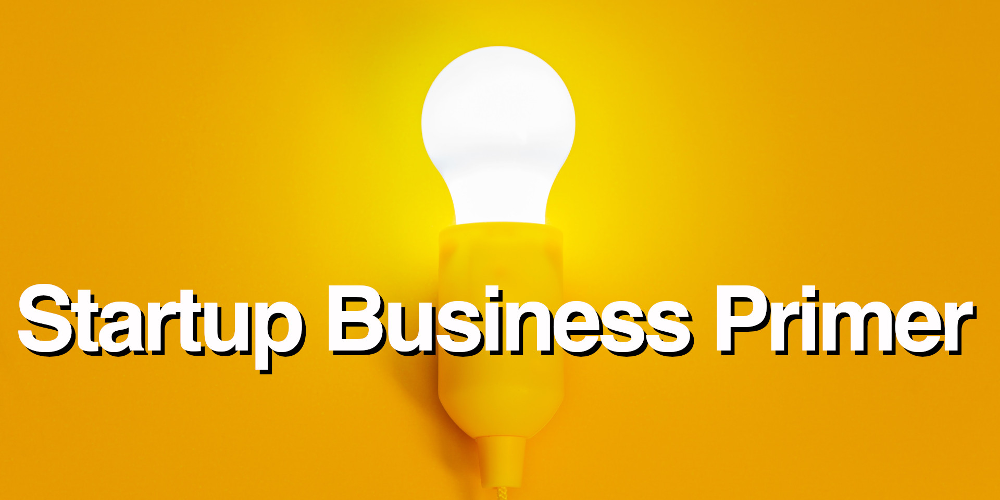

<!--
* browser: startup-business-guide
* tracker: af923c5383c0a63101de326f9b28adad
* version: 1.2.0
* updated: 2023-07-26T12:15:33Z
* contact: Joel Parker Henderson (http://joelparkerhenderson.com)
* options: commentable
-->

# Startup Business Guide

Startup Business Guide: this book explains one topic per page, like a big glossary, easy wiki, quick encyclopedia, or summary notes.

* Download the [free ebook](startup-business-guide.pdf)
* You can [pay what you want](https://gumroad.com/l/startup-business-guide)
* Edited by [Joel Parker Henderson](https://github.com/joelparkerhenderson)
* For questions and suggestions [email me](mailto:joel@joelparkerhenderson.com)

## Contents

### [Introduction](topics/startup-business-guide-introduction)

## Launch

### [How to find startup help](topics/how-to-find-startup-help)

* [How to find startup ideas](topics/how-to-find-startup-ideas)
* [How to find startup mentors](topics/how-to-find-startup-mentors)
* [How to find startup investors](topics/how-to-find-startup-investors)
* [How to find startup employees](topics/how-to-find-startup-employees)
* [How to find startup customers](topics/how-to-find-startup-customers)
* [How to find startup consultants](topics/how-to-find-startup-consultants)
* [How to find startup recruiters](topics/how-to-find-startup-recruiters)
* [How to find startup loans](topics/how-to-find-startup-loans)
* [How to create a minimum viable product](topics/how-to-create-a-minimum-viable-product)
* [How to achieve product market fit](topics/how-to-achieve-product-market-fit)

### [Pitching](topics/pitching)

* [Value proposition](topics/value-proposition)
* [Elevator pitch](topics/elevator-pitch)
* [Pitch deck](topics/pitch-deck)
* [Pitch competition](topics/pitch-competition)
* [Business Model Canvas (BMC)](topics/business-model-canvas)
* [Business plan](topics/business-plan)
* [Business plan competition](topics/business-plan-competition)
* [Demo day](topics/demo-day)

### [Startup discovery](topics/startup-discovery)

* [Market discovery](topics/market-discovery)
* [Market discovery questions](topics/market-discovery-questions)
* [Customer discovery](topics/customer-discovery)
* [Customer discovery questions](topics/customer-discovery-questions)
* [Product discovery](topics/product-discovery)
* [Product discovery questions](topics/product-discovery-questions)

### [Startup life cycle](topics/startup-life-cycle)

* [Product-market fit (PMF)](topics/product-market-fit)
* [Continuous learning](topics/continuous-learning)
* [Validated learning](topics/validated-learning)
* [Build-Measure-Learn](topics/build-measure-learn)
* [Minimum viable product (MVP)](topics/minimum-viable-product)
* [Minimum lovable product (MLP)](topics/minimum-lovable-product)
* [Minimum learnable product (MLnP)](topics/minimum-learnable-product)
* [Minimum Effective Dose (MED)](topics/minimum-effective-dose)
* [Investment Readiness Level (IRL)](topics/investment-readiness-level)

### [Startup entrances](topics/startup-entrances)

* [Incubator](topics/incubator)
* [Accelerator](topics/accelerator)
* [Skunkworks](topics/skunkworks)
* [Spinoff](topics/spinoff)
* [Spinout](topics/spinout)
* [Technology transfer](topics/technology-transfer)

### [Startup step-ups](topics/startup-step-ups)

* [Solopreneur](topics/solopreneur)
* [Cottage business](topics/cottage-business)
* [Lifestyle business](topics/lifestyle-business)

### [Startup exits](topics/startup-exits)

* [Initial Public Offering (IPO)](topics/initial-public-offering)
* [Mergers and Acquisitions (M&A)](topics/mergers-and-acquisitions)
* [Special Purpose Acquisition Company (SPAC)](topics/special-purpose-acquisition-company)
* [Acquihire](topics/acquihire)
* [Unicorn](topics/unicorn)
* [Zombie](topics/zombie)

## Strategy

### [Vision, Mission, Values](topics/vision-mission-values)

* [Vision statement](topics/vision-statement) + [examples](topics/vision-statement-examples)
* [Mission statement](topics/mission-statement) + [examples](topics/mission-statement-examples)
* [Values statement](topics/values-statement) + [examples](topics/values-statement-examples)

### [Business model](topics/business-model)

* [Direct sales business model](topics/direct-sales-business-model)
* [Direct sales business model - pros/cons](topics/direct-sales-business-model-pros-cons)
* [Subscription business model](topics/subscription-business-model)
* [Subscription business model - pros/cons](topics/subscription-business-model-pros-cons)
* [Advertising business model](topics/advertising-business-model)
* [Advertising business model - pros/cons](topics/advertising-business-model-pros-cons)
* [Marketplace business model](topics/marketplace-business-model)
* [Marketplace business model - pros/cons](topics/marketplace-business-model-pros-cons)
* [Franchise business model](topics/franchise-business-model)
* [Franchise business model - pros/cons](topics/franchise-business-model-pros-cons)

### [Strategic effects](topics/strategic-effects)

* [Network effects](topics/network-effects)
* [Platform effects](topics/platform-effects)
* [Flywheel effects](topics/flywheel-effects)
* [Viral effects](topics/viral-effects)
* [Moat effects](topics/moat-effects)
* [Threshold effects](topics/threshold-effects)
* [Scale effects](topics/scale-effects)
* [Leverage effects](topics/leverage-effects)
* [Monopoly effects](topics/monopoly-effects)

### [Business analysis](topics/business-analysis)

* [Five Forces analysis](topics/five-forces-analysis)
* [PESTLE analysis](topics/pestle-analysis)
* [SWOT analysis](topics/swot-analysis)
* [Feasibility analysis](topics/feasibility-analysis)
* [Stakeholder analysis](topics/stakeholder-analysis)
* [Use case analysis](topics/use-case-analysis)
* [Process mapping](topics/process-mapping)
* [Value stream mapping (VSM)](topics/value-stream-mapping)
* [Maturity models](topics/maturity-models)
* [Demand forecasting](topics/demand-forecasting)
* [Predictive analytics](topics/predictive-analytics)

### [Time-to-market (TTM)](topics/time-to-market)

* [First-mover advantage](topics/first-mover-advantage)
* [Crossing the chasm](topics/crossing-the-chasm-by-geoffrey-moore)
* [Early adopters](topics/early-adopters)
* [Early evangelists](topics/early-evangelists)
* [Cold start problem](topics/cold-start-problem)
* [Cold start strategy](topics/cold-start-strategy)

## Industry introductions

### [Technology sectors](topics/technology-sectors)

* [Adtech (Advertising technology)](topics/adtech)
* [Agtech (Agricultural technology)](topics/agtech)
* [Biotech (Biological technology)](topics/biotech)
* [Cleantech (Clean technology)](topics/cleantech)
* [Edtech (Educational technology)](topics/edtech)
* [Fintech (Financial technology)](topics/fintech)
* [Govtech (Governmental technology)](topics/govtech)
* [Legtech (Legal technology)](topics/legtech)
* [Martech (Marketing technology)](topics/martech)
* [Medtech (Medical technology)](topics/medtech)
* [Regtech (Regulatory technology)](topics/regtech)
* [Realtech (Real estate technology)](topics/realtech)

## Company touchpoints

### [Company leadership roles](topics/company-leadership-roles)

* [Chief Executive Officer (CEO)](topics/chief-executive-officer)
* [Chief Technology Officer (CTO)](topics/chief-technology-officer)
* [Chief Financial Officer (CFO)](topics/chief-financial-officer)
* [Chief Operating Officer (COO)](topics/chief-operating-officer)
* [Chief Human Resources Officer (CHRO)](topics/chief-human-resources-officer)
* [Chief Information Officer (CIO)](topics/chief-information-officer)
* [Chief Legal Officer (CLO)](topics/chief-legal-officer)
* [Chief Product Officer (CPO)](topics/chief-product-officer)
* [Chief Marketing Officer (CMO)](topics/chief-marketing-officer)
* [Chief Security Officer (CSO)](topics/chief-security-officer)
* [Chief Risk Officer (CSO)](topics/chief-risk-officer)
* [Executive Director (ED)](topics/executive-director)
* [Chairperson of the Board (COB)](topics/chairperson-of-the-board)
* [Board of Directors (BOD)](topics/board-of-directors)
* [Board of Advisors (BOA)](topics/board-of-advisors)

### Company management roles

* [Chief of Staff (CoS)](topics/chief-of-staff)
* [Account Executive (AE)](topics/account-executive)
* [Account Manager (AM)](topics/account-manager)
* [Sales Engineer (SE)](topics/sales-engineer)
* [Product Manager](topics/product-manager)
* [Project Manager (PM)](topics/project-manager)
* [Partnership Manager](topics/partnership-manager)
* [General Manager (GM)](topics/general-manager)
* [Grants Manager](topics/grants-manager)
* [Community Manager](topics/community-manager)
* [Compliance Manager](topics/compliance-manager)
* [Customer Service Representative (CSR)](topics/customer-service-representative)
* [Subject Matter Expert (SME)](topics/subject-matter-expert)

### [Company departments](topics/company-departments)

* [Sales department](topics/sales-department)
* [Marketing department](topics/marketing-department)
* [Engineering department](topics/engineering-department)
* [Operations department](topics/operations-department)
* [Customer service department](topics/customer-service-department)
* [Finance department](topics/finance-department)
* [Legal department](topics/legal-department)
* [Human resources (HR) department](topics/human-resources-department)
* [Risk Management (RM) department](topics/risk-management-department)
* [General and Administrative (G&A) department](topics/general-and-administrative-department)
* [Research and Development (R&D) department](topics/research-and-development-department)
* [Investor Relations (IR)](topics/investor-relations)
* [Government Relations (GR)](topics/government-relations)
* [Developer Relations (DR)](topics/developer-relations)

### [Organizational values frameworks](topics/organizational-values-frameworks)

* [Code of conduct](topics/code-of-conduct)
* [Code of ethics](topics/code-of-ethics)
* [Membership values](topics/membership-values)
* [Leadership values](topics/leadership-values)
* [Cultural values](topics/cultural-values)
* [Corporate Social Responsibility (CSR)](topics/corporate-social-responsibility)
* [Diversity, Equity, Inclusion, Belonging (DEIB)](topics/diversity-equity-inclusion-belonging)
* [Global Reporting Initiative (GRI)](topics/global-reporting-initiative)
* [Human Development Index (HDI)](topics/human-development-index)
* [Seventh Generation Principle](topics/seventh-generation-principle)
* [Social value orientation (SVO)](topics/social-value-orientation)
* [Triple bottom line (TBL)](topics/triple-bottom-line)
* [Inclusive language](topics/inclusive-language)
* [Culture fit and values alignment](topics/culture-fit-and-values-alignment)

### [Cultural dimensions](topics/cultural-dimensions)

* [Power distance](topics/power-distance)
* [Individualism versus collectivism](topics/individualism-versus-collectivism)
* [Long-term orientation versus short-term orientation](topics/long-term-orientation-versus-short-term-orientation)
* [Uncertainty avoidance](topics/uncertainty-avoidance)
* [Indulgence versus restraint](topics/indulgence-versus-restraint)
* [Masculinity versus femininity ](topics/masculinity-versus-femininity)

## Sales

### [Sales introduction](topics/sales)

* [Business-to-Business (B2B)](topics/business-to-business)
* [Business-to-Consumer (B2C)](topics/business-to-consumer)
* [Business-to-Business-to-Consumer (B2B2C)](topics/business-to-business-to-consumer)
* [Peer-to-Peer (P2P)](topics/peer-to-peer)
* [Sales funnel](topics/sales-funnel)
* [Winner-take-all](topics/winner-take-all)
* [Vendor lock-in](topics/vendor-lock-in)
* [Sales-led growth (SLG)](topics/sales-led-growth)
* [Product-led growth (PLG)](topics/product-led-growth)
* [Growth hacking](topics/growth-hacking)
* [Hockey-stick growth](topics/hockey-stick-growth)

### [Pricing models](topics/pricing-models)

* [Cost-plus pricing](topics/cost-plus-pricing)
* [Value-based pricing](topics/value-based-pricing)
* [Bundled pricing](topics/bundled-pricing)
* [Subscription pricing](topics/subscription-pricing)
* [Tiered pricing](topics/tiered-pricing)
* [Dynamic pricing](topics/dynamic-pricing)
* [Pay-what-you-want (PWYW)](topics/pay-what-you-want)
* [Freemium](topics/freemium)
* [Free trial](topics/free-trial)

## Marketing

### [Marketing introduction](topics/marketing)

* [Marketing channels](topics/marketing-channels)
* [Affiliate marketing](topics/affiliate-marketing)
* [Attribute-based marketing](topics/attribute-based-marketing)
* [Content marketing](topics/content-marketing)
* [Guerilla marketing](topics/guerilla-marketing)
* [Word-of-mouth marketing (WOMM)](topics/word-of-mouth-marketing)
* [Customer relationship management (CRM)](topics/customer-relationship-management)
* [Stealth mode](topics/stealth-mode)
* [Thought leadership](topics/thought-leadership)
* [Social proof](topics/social-proof)

### [Market estimation](topics/market-estimation)

* [Total Addressable Market (TAM)](topics/total-addressable-market)
* [Service Addressable Market (SAM)](topics/service-addressable-market)
* [Service Obtainable Market (SOM)](topics/service-obtainable-market)

### [Brand management](topics/brand-management)

* [Brand value](topics/brand-value)
* [Brand equity](topics/brand-equity)
* [Brand visibility](topics/brand-visibility)
* [Brand association](topics/brand-association)
* [Brand loyalty](topics/brand-loyalty)
* [Brand marketing](topics/brand-marketing)
* [Brand recognition](topics/brand-recognition)
* [Brand positioning](topics/brand-positioning)
* [Brand ambassador](topics/brand-ambassador)

## Planning

## [North Star](topics/north-star)

* [Big Hairy Audacious Goal (BHAG)](topics/big-hairy-audacious-goal)
* [Strategic balanced scorecard (SBS)](topics/strategic-balanced-scorecard)
* [Ideation](topics/ideation)
* [Shoshin](topics/shoshin)
* [Creative thinking techniques](topics/creative-thinking-techniques)
* [Brainstorming](topics/brainstorming)
* [Thinking hats](topics/thinking-hats)
* [SCAMPER](topics/scamper)
* [Oblique strategies](topics/oblique-strategies)
* [Futurespective](topics/futurespective)
* [Storyboard](topics/storyboard)
* [Storyboard steps](topics/storyboard-steps)
* [Gantt chart](topics/gantt-chart)
* [Quad chart](topics/quad-chart)

## [Intent plan](topics/intent-plan)

* [Objectives and Key Results (OKRs)](topics/objectives-and-key-results)
* [Key Performance Indicators (KPIs)](topics/key-performance-indicators)
* [Key Risk Indicators (KRIs)](topics/key-risk-indicators)
* [Critical Success Factors (CSFs)](topics/critical-success-factors)
* [Critical To Quality (CTQ)](topics/critical-to-quality)
* [Goals, Ideas, Steps, Tasks (GIST)](topics/goals-ideas-steps-tasks)
* [Risks, Actions, Issues, Decisions (RAID)](topics/risks-actions-issues-decisions)
* [SPADE decision framework](topics/spade-decision-framework)
* [SMART criteria](topics/smart-criteria)
* [Cynefin framework](topics/cynefin-framework)
* [Issue tracker](topics/issue-tracker)
* [Mind map](topics/mind-map)
* [Decision tree](topics/decision-tree)
* [Decision record](topics/decision-record)
* [Business continuity](topics/business-continuity)
* [Operational resilience](topics/operational-resilience)
* [Crowdsourcing](topics/crowdsourcing)
* [Planning poker estimation](topics/planning-poker-estimation)

### [Change management](topics/change-management)

* [Six Sigma methodology](topics/six-sigma-methodology)
* [DMAIC methodology](topics/dmaic-methodology)
* [Plan-Do-Check-Act (PDCA)](topics/plan-do-check-act)
* [OODA loop](topics/ooda-loop)
* [OODA loop v DMAIC cycle v PDCA spiral](topics/ooda-loop-v-dmaic-cycle-v-pdca-spiral)
* [Kaizen](topics/kaizen)
* [ADKAR change management model](topics/adkar-change-management-model)

### Miscellaneous

* [Creative Enterprise Zone (CEZ)](topics/creative-enterprise-zone)
* [Economic moat](topics/economic-moat)
* [Economies of scale](topics/economies-of-scale)
* [Aggregation theory](topics/aggregation-theory)
* [Commoditization of trust](topics/commoditization-of-trust)
* [Go-to-market strategy](topics/go-to-market-strategy)
* [Strategy map](topics/strategy-map)
* [EBFAS organizational climate](topics/ebfas-organizational-climate)
* [Project management](topics/project-management) - See Project Management Guide
* [UI/UX](topics/ui-ux) - See UI/UX Guide

## Design Development

* [Big design up front (BDUF)](topics/big-design-up-front)
* [Domain-Driven Design (DDD)](topics/domain-driven-design)
* [Behavior-Driven Development (BDD)](topics/behavior-driven-development)
* [Test-Driven Development (TDD)](topics/test-driven-development)
* [Voice of the Customer (VoC)](topics/voice-of-the-customer)

## Business metrics

* [Earnings before interest, taxes, amortization (EBITA)](topics/earnings-before-interest-taxes-amortization)
* [Annual Recurring Revenue (ARR)](topics/annual-recurring-revenue)
* [Burn rate](topics/burn-rate)
* [Traction](topics/traction)
* [Lifetime Value (LTV)](topics/lifetime-value)
* [Churn rate](topics/churn-rate)
* [Customer Acquisition Cost (CAC)](topics/customer-acquisition-cost)
* [Net Promoter Score (NPS)](topics/net-promoter-score)
* [Employee Net Promoter Score (eNPS)](topics/employee-net-promoter-score)

### [Teamwork](topics/teamwork)

* [Forming, Storming, Norming, Performing (FSNP)](topics/forming-storming-norming-performing)
* [Icebreaker questions](topics/icebreaker-questions)

### Composition

* [Organizational chart](topics/organizational-chart)
* [Chain of command](topics/chain-of-command)
* [Stakeholders](topics/stakeholders)
* [Roles and responsibilities](topics/roles-and-responsibilities)
* [Responsibility assignment matrix (RAM)](topics/responsibility-assignment-matrix)
* [RACI matrix](topics/raci-matrix)
* [PARIS matrix](topics/paris-matrix)

### Team shapes

* [Pizza team](topics/pizza-team)
* [Squad team](topics/squad-team)
* [Community of Practice (CoP)](topics/community-of-practice)
* [The Spotify Model](topics/the-spotify-model)

### Team locations

* [Outsourcing](topics/outsourcing)
* [Offshoring](topics/offshoring)
* [Nearshoring](topics/nearshoring)
* [Coworking](topics/coworking)

### [Ways Of Working (WOW)](topics/ways-of-working)

* [TEAM FOCUS](topics/team-focus)
* [Blameless retrospective](topics/blameless-retrospective)
* [Pair programming](topics/pair-programming)

## [Digital transformation](topics/digital-transformation)

* [Business information systems](topics/business-information-systems)
* [Change management](topics/change-management)
* [Line-of-business (LOB) application](topics/line-of-business-application)
* [Front-office applications](topics/front-office-applications)
* [Back-office applications](topics/back-office-applications)
* [Standard Operating Procedure (SOP)](topics/standard-operating-procedure)
* [Playbook](topics/playbook)
* [Runbook](topics/runbook)

### [Meetings](topics/meetings)

* [Meeting types](topics/meeting-types)
* [All-hands meeting](topics/all-hands-meeting)
* [Standup meeting](topics/standup-meeting)
* [One-on-one meeting](topics/one-on-one-meeting)
* [Skip-level meeting](topics/skip-level-meeting)

## Quality analysis

* [After-Action Report (AAR)](topics/after-action-report)
* [Cause-and-effect diagram](topics/Cause-and-effect-diagram)
* Fishbone diagram: see cause-and-effect diagram
* [Five Whys analysis](topics/five-whys-analysis)
* Ishikawa diagram: see cause-and-effect diagram
* Non-functional requirements: see system quality attributes
* [Root cause analysis (RCA)](topics/root-cause-analysis)
* [System Quality Attributes (SQAs)](topics/system-quality-attributes)
* [Quality of Service (QoS) for networks](topics/quality-of-service-for-networks)
* [Good Enough For Now (GEFN)](topics/good-enough-for-now)
* [Technical debt](topics/technical-debt)
* [Refactoring](topics/refactoring)

## [Statistical analysis](topics/statistical-analysis)

* [Descriptive statistics](topics/descriptive-statistics)
* [Inferential statistics](topics/inferential-statistics)
* [Correlation](topics/correlation)
* [Causation](topics/causation)
* [Probability](topics/probability)
* [Variance](topics/variance)
* [Trend analysis](topics/trend-analysis)
* [Anomaly detection](topics/anomaly-detection)
* [Discrete outcome](topics/discrete-outcome)
* [Quantitative fallacy](topics/quantitative-fallacy)
* [Regression to the mean](topics/regression-to-the-mean)
* [Bayes' theorem](topics/bayes-theorem)
* [Chi-square analysis](topics/chi-square-analysis)
* [Monte Carlo methods](topics/monte-carlo-methods)
* [Statistical analysis techniques](topics/statistical-analysis-techniques)

### [Artificial intelligence (AI)](topics/artificial-intelligence)

* [AI for business strategy](topics/ai-for-business-strategy)
* [AI for product development](topics/ai-for-product-development)
* [AI for project management](topics/ai-for-project-management)
* [AI for partner management](topics/ai-for-partner-management)
* For more, see our [AI Starter Guide](topics/https://github.com/sixarm/ai-starter-guide)
  
## Accounting

* [Generally Accepted Accounting Principles (GAAP)](topics/generally-accepted-accounting-principles)
* [Profit and loss (P&L)](topics/profit-and-loss)
* [Gross profit and net profit](topics/gross-profit-and-net-profit)
* [Assets and liabilities](topics/assets-and-liabilities)
* [Balance sheet](topics/balance-sheet)

### Accounting metrics

* [Financial ratios](topics/financial-ratios)
* [Internal Rate of Return (IRR)](topics/internal-rate-of-return)
* [Return On Investment (ROI)](topics/return-on-investment)
* [Total Cost of Ownership (TCO)](topics/total-cost-of-ownership)
* [Discounted Cash Flow (DCF)](topics/discounted-cash-flow)
* [Net Present Value (NPV)](topics/net-present-value)
* [Fixed costs](topics/fixed-costs)
* [Cost of goods sold (COGS)](topics/cost-of-goods-sold)
* [Unit cost](topics/unit-cost)
* [Inventory turnover](topics/inventory-turnover)
* [Carrying costs](topics/carrying-costs)

### [Financing](topics/financing)

* [Bootstrapping](topics/bootstrapping)
* [Crowdfunding](topics/crowdfunding)
* [Debt financing](topics/debt-financing)
* [Small business loan](topics/small-business-loan)
* [Bridge loan](topics/bridge-loan)
* [Convertible note](topics/convertible-note)
* [Equity financing](topics/equity-financing)
* [Simple Agreement For Future Equity (SAFE)](topics/simple-agreement-for-future-equity)
* [Private equity](topics/private-equity)
* [Priced round](topics/priced-round)
* [Drag-along rights](topics/drag-along-rights)
* [Carried interest](topics/carried-interest)
* [Due diligence](topics/due-diligence)

## Fundraising

### [Investors](topics/investors)

* [Friends and family investor](topics/friends-and-family-investor)
* [Accredited investor](topics/accredited-investor)
* [Venture capital investor](topics/venture-capital-investor)
* [Angel investor](topics/angel-investor)
* [Seed investor](topics/seed-investor)
* [Series A investor](topics/series-a-investor)
* [Series B investor](topics/series-b-investor)

### [Equity](topics/equity)

* [Capitalization table](topics/capitalization-table)
* [Term sheet](topics/term-sheet)
* [Startup equity division](topics/startup-equity-division)
* [Vesting schedule](topics/vesting-schedule)
* [Vesting cliff](topics/vesting-cliff)
* [Sweat equity](topics/sweat-equity)
* [Profit sharing](topics/profit-sharing)
* [Full Ratchet](topics/full-ratchet)
* [Pay-to-play](topics/pay-to-play)

### [Valuation](topics/valuation)

* [Valuation approaches](topics/valuation-approaches)
* [Valuation approaches for startups](topics/valuation-approaches-for-startups)
* [Pre-money valuation and post-money valuation](topics/pre-money-valuation-and-post-money-valuation)
* [409A valuation](topics/409a-valuation)
* [83(b) election](topics/83-b-election)

### [Stock options](topics/stock-options)

* [Employee stock option pool](topics/employee-stock-option-pool)
* [Employee stock purchase plan (ESPP)](topics/employee-stock-purchase-plan)
* [Restricted stock units (RSUs)](topics/restricted-stock-units)
* [Stock buyback](topics/stock-buyback)
* [Liquidity event](topics/liquidity-event)
* [Liquidation preference](topics/liquidation-preference)
* [Lock-up](topics/lock-up)

### [Startup venture capital companies](topics/startup-venture-capital-companies)

* [500 Startups](topics/500.co)
* [Accel](topics/accel.com)
* [Andreessen Horowitz (a16z)](topics/a16z.com)
* [Antler](topics/antler.co)
* [Bethnal Green Ventures](topics/bethnalgreenventures.com)
* [Greylock Partners](topics/greylock.com)
* [Index Ventures](topics/indexventures.com)
* [Kleiner Perkins](topics/kleinerperkins.com)
* [New Enterprise Associates (NEA)](topics/nea.com)
* [Sequoia Capital](topics/sequoiacap.com)
* [Y Combinator (YC)](topics/ycombinator.com)

## Law

### [Intellectual Property (IP)](topics/intellectual-property)

* [Patent](topics/patent)
* [Copyright](topics/copyright)
* [Trademark](topics/trademark)
* [Trade secret](topics/trade-secret)
* [Industrial design rights](topics/industrial-design-rights)

### [Company legal entities](topics/company-legal-entities)

* [Sole proprietorship](topics/sole-proprietorship)
* [Partnership company](topics/partnership-company)
* [Limited Liability Company (LLC)](topics/limited-liability-company)
* [C Corporation](topics/c-corporation)
* [S Corporation](topics/s-corporation)
* [B Corporation](topics/b-corporation)

### [Legal agreements](topics/legal-agreements)

* [Employee agreement](topics/employee-agreement)
* [Service agreement](topics/service-agreement)
* [Consulting agreement](topics/consulting-agreement)
* [Subcontracting agreement](topics/subcontracting-agreement)
* [Framework agreement](topics/framework-agreement)
* [Partnership agreement](topics/partnership-agreement)
* [Joint Venture agreement (JVA)](topics/joint-venture-agreement)
* [Confidentiality agreement](topics/confidentiality-agreement)
* [Non-disclosure agreement (NDA)](topics/non-disclosure-agreement)
* [Non-compete agreement](topics/non-compete-agreement)
* [Non-solicitation agreement](topics/non-solicitation-agreement)
* [Work-for-hire agreement](topics/work-for-hire-agreement)
* [Arbitration agreement](topics/arbitration-agreement)
* [Letter Of Intent (LOI)](topics/letter-of-intent)
* [Power Of Attorney (POA)](topics/power-of-attorney)
* Memorandum Of Understanding (MOU): see Letter Of Intent (LOI)
* Master Services Agreement (MSA): see Framework agreement

### [Technology transfer agreements](topics/technology-transfer-agreements)

* [Licensing agreement (LA)](topics/licensing-agreement)
* [Joint development agreement (JDA)](topics/joint-development-agreement)
* [Assignment agreement (AA)](topics/assignment-agreement)
* [Cooperative Research and Development Agreement (CRADA)](topics/cooperative-research-and-development-agreement)
* [Facility Use/Service Agreement (FUSA)](topics/facility-use-service-agreement)
* [Material Transfer Agreement (MTA)](topics/material-transfer-agreement)
* [Technical Assistance Agreement (TAA)](topics/technical-assistance-agreement)
* [Technology Transfer Office (TTO)](topics/technology-transfer-office)

### Work contracts

* [Fixed-price contract](topics/fixed-price-contract)
* [Cost-plus contract](topics/cost-plus-contract)
* [Time and materials contract](topics/time-and-materials-contract)

### [Compliance](topics/compliance)

* [International Standard on Assurance Engagements 3000 (ISAE 3000)](topics/international-standard-on-assurance-engagements-3000)
* [Service Organization Control 2 (SOC 2)](topics/service-organization-control-2)
* [Sarbanes-Oxley Act (SOX)](topics/sarbanes-oxley-act)
* [General Data Protection Regulation (GDPR)](topics/general-data-protection-regulation)
* [Americans with Disabilities Act (ADA)](topics/americans-with-disabilities-act)
* [Health Insurance Portability and Accountability Act (HIPAA)](topics/health-insurance-portability-and-accountability-act)
* [Family Educational Rights and Privacy Act (FERPA)](topics/family-educational-rights-and-privacy-act)
* [Payment Card Industry Data Security Standard (PCI DSS)](topics/payment-card-industry-data-security-standard)

## Major league

### [Globalization](topics/globalization)

* [Global business](topics/global-business)
* [Global business modes](topics/global-business-modes)
* [Cross-border controls](topics/cross-border-controls)
* [Internationalization and localization](topics/internationalization-and-localization)

### [Global business regions](topics/global-business-regions)

* [The Americas (AMERS) region](topics/the-americas-region)
* [Europe, Middle East, Africa (EMEA) region](topics/europe-middle-east-africa-region)
* [Asia-Pacific (APAC) region](topics/asia-pacific-region)
* [Latin America (LATAM) region](topics/latin-america-region)
* [Oceania region](topics/oceania-region)

### [Visa sponsorship](topics/visa-sponsorship)

* [US H-1B Visa](topics/us-h-1b-visa)
* [UK Global Talent Visa](topics/uk-global-talent-visa)
* [EU Blue Card](topics/eu-blue-card)

### [Enterprise companies](topics/enterprise-companies)

* [Enterprise sales cycles](topics/enterprise-sales-cycles)
* [Enterprise account management](topics/enterprise-account-management)
* [Enterprise Portfolio Project Management (EPPM)](topics/enterprise-portfolio-project-management)
* [Enterprise Resource Planning (ERP)](topics/enterprise-resource-planning)
* [Enterprise Change Management (ECM)](topics/enterprise-change-management)
* [Enterprise Architecture (EA)](topics/enterprise-architecture)
* [Enterprise software](topics/enterprise-software)

## Lore

### [Aphorisms](topics/aphorisms)

* [Brooks' Law](topics/brooks-law)
* [Conway's Law](topics/conways-law)
* [Gresham’s Law](topics/greshams-law)
* [Hyrum’s Law](topics/hyrums-law)
* [Metcalfe's Law](topics/metcalfes-law)
* [Moore's Law](topics/moores-law)
* [The Law of Demos (Kapor's Law)](topics/the-law-of-demos)
* [The Law of Supply and Demand](topics/the-law-of-supply-and-demand)
* [The Law of Conservation of Complexity (Tesler's Law)](topics/the-law-of-conservation-of-complexity)
* [The Law of Large Numbers](topics/the-law-of-large-numbers)
* [The Pareto Principle (The 80/20 Rule)](topics/the-pareto-principle)
* [The Principle of Least Knowledge (The Law of Demeter)](topics/the-principle-of-least-knowledge)
* [Chesterton's fence](topics/chestertons-fence)
* [The Tragedy of the Commons](topics/the-tragedy-of-the-commons)

### [Idioms](topics/idioms)

* [Quick wins](topics/quick-wins)
* [Think outside of the box](topics/think-outside-of-the-box)
* [Unknown unknowns](topics/unknown-unknowns)
* [Stretch goal](topics/stretch-goal)
* [Firefighting mode](topics/firefighting-mode)
* For more see our [Business Lingo Guide](topics/https://github.com/sixarm/business-lingo-guide)

### [Entrepreneur quotations](topics/entrepreneur-quotations)

* [A rising tide lifts all boats](topics/a-rising-tide-lifts-all-boats)
* [Culture eats strategy for breakfast](topics/culture-eats-strategy-for-breakfast)
* [Execution eats strategy for lunch](topics/execution-eats-strategy-for-lunch)
* [A startup is a company that is confused](topics/a-startup-is-a-company-that-is-confused)
* [Move fast and break things](topics/move-fast-and-break-things)
* [Ideas are easy, implementation is hard](topics/ideas-are-easy-implementation-is-hard)
* [Learn early, learn often](topics/learn-early-learn-often)
* [Make mistakes faster](topics/make-mistakes-faster)
* [Perfect is the enemy of good](topics/perfect-is-the-enemy-of-good)
* [Data beats emotions](topics/data-beats-emotions)
* [Look for the people who want to change the world](topics/look-for-the-people-who-want-to-change-the-world)
* [See things in the present, even if they are in the future](topics/see-things-in-the-present-even-if-they-are-in-the-future)

### [Soft skills](topics/soft-skills)

* [How to give a demo](topics/how-to-give-a-demo)
* [How to collaborate](topics/how-to-collaborate)
* [How to lead a meeting](topics/how-to-lead-a-meeting)
* [How to work with stakeholders](topics/how-to-work-with-stakeholders)
* [How to get feedback](topics/how-to-get-feedback)
* [How to give feedback](topics/how-to-give-feedback)

### [Conclusion](topics/startup-business-guide-conclusion)

* [About the author](topics/about-the-author)
* [About the AI](topics/about-the-ai)
* [About the ebook PDF](topics/about-the-ebook-pdf)
* [About related projects](topics/about-related-projects)
* [About the guides](topics/about-the-guides)

## All our guides

* [Innovation Partnership Guide](https://github.com/sixarm/innovation-partnership-guide)
* [Startup Business Guide](https://github.com/sixarm/startup-business-guide)
* [Business Lingo Guide](https://github.com/sixarm/business-lingo-guide)
* [Project Management Guide](https://github.com/sixarm/project-management-guide)
* [UI/UX Design Guide](https://github.com/sixarm/ui-ux-design-guide)
* [Software Programming Guide](https://github.com/sixarm/software-programming-guide)
* [AI Starter Guide](https://github.com/sixarm/ai-starter-guide)
